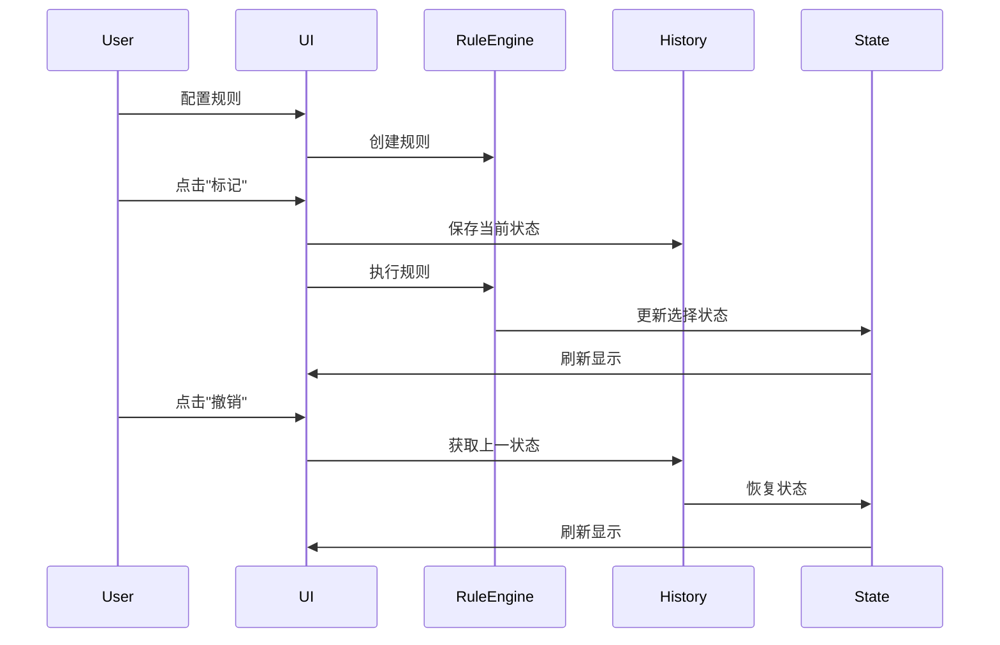

# Design Document: Selection Assistant

## Overview

选择助手是一个高度可扩展的文件选择系统，参考 Duplicate Cleaner Pro 设计。系统采用规则引擎架构，支持三大类选择规则的组合执行，并提供完整的撤销/重做功能。

### 技术选型

- **状态管理**: Jotai（与现有项目一致）
- **撤销/重做**: `jotai-history` - Jotai 官方推荐的历史管理库，提供 UNDO/REDO/RESET 操作
- **模式匹配**: `ts-pattern` - TypeScript 模式匹配库，用于规则条件匹配，类型安全且表达力强
- **配置验证**: `zod` - TypeScript-first 的 schema 验证库，用于规则配置验证
- **拖拽排序**: `@dnd-kit/core` + `@dnd-kit/sortable` - 现代化的拖拽库，用于规则排序
- **UI组件**: 复用现有 shadcn/ui 组件

## Architecture

```
┌─────────────────────────────────────────────────────────────┐
│                    Selection Assistant                       │
├─────────────────────────────────────────────────────────────┤
│  ┌─────────────┐  ┌─────────────┐  ┌─────────────────────┐  │
│  │   UI Layer  │  │History Mgr  │  │   Rule Engine       │  │
│  │             │◄─┤  (Undo/Redo)│◄─┤                     │  │
│  └──────┬──────┘  └─────────────┘  │  ┌───────────────┐  │  │
│         │                          │  │ Rule Pipeline │  │  │
│         ▼                          │  └───────┬───────┘  │  │
│  ┌─────────────────────────────┐   │          │          │  │
│  │     Selection State         │◄──┤  ┌───────▼───────┐  │  │
│  │  (Jotai Atom)               │   │  │  Rule Types   │  │  │
│  └─────────────────────────────┘   │  │ ┌───────────┐ │  │  │
│                                    │  │ │  Group    │ │  │  │
│                                    │  │ │  Text     │ │  │  │
│                                    │  │ │  Directory│ │  │  │
│                                    │  │ └───────────┘ │  │  │
│                                    │  └───────────────┘  │  │
│                                    └─────────────────────┘  │
└─────────────────────────────────────────────────────────────┘
```

## Components and Interfaces

### 1. 规则接口定义

```typescript
// ui/src/lib/selection-assistant/types.ts

/** 选择动作类型 */
export type SelectionAction = 'mark' | 'unmark';

/** 规则执行上下文 */
export interface RuleContext<T extends BaseEntry & Partial<RefEntry>> {
  /** 当前数据列表 */
  data: T[];
  /** 当前选择状态 */
  currentSelection: Set<string>;
  /** 是否保持已选择不变 */
  keepExistingSelection: boolean;
  /** 选择动作 */
  action: SelectionAction;
}

/** 规则执行结果 */
export interface RuleResult {
  /** 新的选择状态（路径集合） */
  selection: Set<string>;
  /** 受影响的文件数量 */
  affectedCount: number;
  /** 执行是否成功 */
  success: boolean;
  /** 错误信息（如果有） */
  error?: string;
}

/** 规则验证结果 */
export interface ValidationResult {
  valid: boolean;
  errors: string[];
}

/** 选择规则基础接口 */
export interface SelectionRule<TConfig = unknown> {
  /** 规则唯一标识 */
  id: string;
  /** 规则类型 */
  type: RuleType;
  /** 规则配置 */
  config: TConfig;
  /** 是否启用 */
  enabled: boolean;
  /** 执行规则 */
  execute<T extends BaseEntry & Partial<RefEntry>>(ctx: RuleContext<T>): RuleResult;
  /** 验证配置 */
  validate(): ValidationResult;
  /** 获取规则描述 */
  describe(): string;
  /** 预览受影响的文件数 */
  preview<T extends BaseEntry & Partial<RefEntry>>(ctx: RuleContext<T>): number;
}

/** 规则类型枚举 */
export type RuleType = 'group' | 'text' | 'directory';
```

### 2. 按组别选择规则

```typescript
// ui/src/lib/selection-assistant/rules/group-rule.ts

/** 组选择模式 */
export type GroupSelectionMode = 
  | 'selectAllExceptOne'  // 每组除了一份文件之外其他所有
  | 'selectOne'           // 每组选择一份
  | 'selectAll';          // 选择所有

/** 排序字段 */
export type SortField = 
  | 'folderPath'      // 文件夹路径
  | 'fileName'        // 文件名
  | 'fileSize'        // 文件大小
  | 'creationDate'    // 创建日期
  | 'modifiedDate'    // 修改日期
  | 'resolution';     // 分辨率（仅图片）

/** 排序方向 */
export type SortDirection = 'asc' | 'desc';

/** 排序条件 */
export interface SortCriterion {
  field: SortField;
  direction: SortDirection;
  preferEmpty: boolean;  // 空值优先
  enabled: boolean;
}

/** 组选择规则配置 */
export interface GroupRuleConfig {
  mode: GroupSelectionMode;
  sortCriteria: SortCriterion[];
  keepExistingSelection: boolean;
}
```

### 3. 按文本模式选择规则

```typescript
// ui/src/lib/selection-assistant/rules/text-rule.ts

/** 文本匹配列 */
export type TextColumn = 'folderPath' | 'fileName' | 'fullPath';

/** 匹配条件 */
export type MatchCondition = 
  | 'contains'      // 包含
  | 'notContains'   // 不包含
  | 'equals'        // 等于
  | 'startsWith'    // 开头是
  | 'endsWith';     // 结尾是

/** 文本选择规则配置 */
export interface TextRuleConfig {
  column: TextColumn;
  condition: MatchCondition;
  pattern: string;
  useRegex: boolean;
  caseSensitive: boolean;
  keepExistingSelection: boolean;
}
```

### 4. 按目录位置选择规则

```typescript
// ui/src/lib/selection-assistant/rules/directory-rule.ts

/** 目录选择模式 */
export type DirectoryMode = 
  | 'keepOnePerDirectory'  // 每个目录保留一个
  | 'selectAllInDirectory' // 选择目录中所有
  | 'excludeDirectory';    // 排除目录

/** 目录选择规则配置 */
export interface DirectoryRuleConfig {
  mode: DirectoryMode;
  directories: string[];
  keepExistingSelection: boolean;
}
```

### 5. 规则管道

```typescript
// ui/src/lib/selection-assistant/pipeline.ts

/** 管道配置 */
export interface PipelineConfig {
  name: string;
  rules: SelectionRule[];
}

/** 规则管道类 */
export class RulePipeline {
  private rules: SelectionRule[] = [];
  
  addRule(rule: SelectionRule): void;
  removeRule(ruleId: string): void;
  reorderRules(fromIndex: number, toIndex: number): void;
  enableRule(ruleId: string, enabled: boolean): void;
  
  execute<T extends BaseEntry & Partial<RefEntry>>(ctx: RuleContext<T>): RuleResult;
  validate(): ValidationResult;
  preview<T extends BaseEntry & Partial<RefEntry>>(ctx: RuleContext<T>): number;
  
  toJSON(): PipelineConfig;
  static fromJSON(config: PipelineConfig): RulePipeline;
}
```

### 6. 历史管理（使用 jotai-history）

```typescript
// ui/src/lib/selection-assistant/history.ts
import { withHistory, UNDO, REDO, RESET } from 'jotai-history';
import { atom } from 'jotai';

// 基础选择状态 atom
export const baseSelectionAtom = atom<Record<string, boolean>>({});

// 带历史记录的选择状态 atom（限制 50 条历史）
export const selectionWithHistoryAtom = withHistory(baseSelectionAtom, 50);

// 使用示例：
// const [history] = useAtomValue(selectionWithHistoryAtom);
// const setHistory = useSetAtom(selectionWithHistoryAtom);
// 
// // 撤销
// setHistory(UNDO);
// 
// // 重做
// setHistory(REDO);
// 
// // 重置历史
// setHistory(RESET);
// 
// // 检查是否可撤销/重做
// history.canUndo
// history.canRedo
```

### 7. 配置验证（使用 zod）

```typescript
// ui/src/lib/selection-assistant/schemas.ts
import { z } from 'zod';

export const sortCriterionSchema = z.object({
  field: z.enum(['folderPath', 'fileName', 'fileSize', 'creationDate', 'modifiedDate', 'resolution']),
  direction: z.enum(['asc', 'desc']),
  preferEmpty: z.boolean(),
  enabled: z.boolean(),
});

export const groupRuleConfigSchema = z.object({
  mode: z.enum(['selectAllExceptOne', 'selectOne', 'selectAll']),
  sortCriteria: z.array(sortCriterionSchema),
  keepExistingSelection: z.boolean(),
});

export const textRuleConfigSchema = z.object({
  column: z.enum(['folderPath', 'fileName', 'fullPath']),
  condition: z.enum(['contains', 'notContains', 'equals', 'startsWith', 'endsWith']),
  pattern: z.string(),
  useRegex: z.boolean(),
  caseSensitive: z.boolean(),
  keepExistingSelection: z.boolean(),
});

export const directoryRuleConfigSchema = z.object({
  mode: z.enum(['keepOnePerDirectory', 'selectAllInDirectory', 'excludeDirectory']),
  directories: z.array(z.string()),
  keepExistingSelection: z.boolean(),
});

// 导入配置时的验证
export const importConfigSchema = z.object({
  version: z.string(),
  groupRule: groupRuleConfigSchema.optional(),
  textRule: textRuleConfigSchema.optional(),
  directoryRule: directoryRuleConfigSchema.optional(),
});
```

### 8. 规则匹配（使用 ts-pattern）

```typescript
// ui/src/lib/selection-assistant/matchers.ts
import { match, P } from 'ts-pattern';
import type { MatchCondition, TextColumn } from './types';

/** 文本匹配器 */
export function matchText(
  text: string,
  pattern: string,
  condition: MatchCondition,
  caseSensitive: boolean,
  useRegex: boolean
): boolean {
  const normalizedText = caseSensitive ? text : text.toLowerCase();
  const normalizedPattern = caseSensitive ? pattern : pattern.toLowerCase();

  if (useRegex) {
    try {
      const flags = caseSensitive ? '' : 'i';
      return new RegExp(pattern, flags).test(text);
    } catch {
      return false;
    }
  }

  return match(condition)
    .with('contains', () => normalizedText.includes(normalizedPattern))
    .with('notContains', () => !normalizedText.includes(normalizedPattern))
    .with('equals', () => normalizedText === normalizedPattern)
    .with('startsWith', () => normalizedText.startsWith(normalizedPattern))
    .with('endsWith', () => normalizedText.endsWith(normalizedPattern))
    .exhaustive();
}

/** 获取文件的指定列值 */
export function getColumnValue(path: string, column: TextColumn): string {
  return match(column)
    .with('fullPath', () => path)
    .with('fileName', () => path.split(/[/\\]/).pop() || '')
    .with('folderPath', () => {
      const lastSep = Math.max(path.lastIndexOf('/'), path.lastIndexOf('\\'));
      return lastSep > 0 ? path.substring(0, lastSep) : '';
    })
    .exhaustive();
}
```

## Data Models

### Jotai Atoms（使用 jotai-history）

```typescript
// ui/src/atom/selection-assistant.ts

import { atom } from 'jotai';
import { atomWithStorage } from 'jotai/utils';
import { withHistory } from 'jotai-history';
import type { GroupRuleConfig, TextRuleConfig, DirectoryRuleConfig, RuleType } from '~/lib/selection-assistant/types';

/** 组选择规则配置 atom */
export const groupRuleConfigAtom = atomWithStorage<GroupRuleConfig>(
  'selection-assistant-group-config',
  {
    mode: 'selectAllExceptOne',
    sortCriteria: [],
    keepExistingSelection: false,
  }
);

/** 文本选择规则配置 atom */
export const textRuleConfigAtom = atomWithStorage<TextRuleConfig>(
  'selection-assistant-text-config',
  {
    column: 'fullPath',
    condition: 'contains',
    pattern: '',
    useRegex: false,
    caseSensitive: false,
    keepExistingSelection: false,
  }
);

/** 目录选择规则配置 atom */
export const directoryRuleConfigAtom = atomWithStorage<DirectoryRuleConfig>(
  'selection-assistant-directory-config',
  {
    mode: 'keepOnePerDirectory',
    directories: [],
    keepExistingSelection: false,
  }
);

/** 当前展开的面板 */
export const expandedPanelAtom = atom<RuleType | null>('group');

// 注意：选择状态的历史管理在 currentToolRowSelectionAtom 上应用
// 使用 withHistory 包装现有的 rowSelectionAtom
```

## Correctness Properties

*A property is a characteristic or behavior that should hold true across all valid executions of a system-essentially, a formal statement about what the system should do. Properties serve as the bridge between human-readable specifications and machine-verifiable correctness guarantees.*

### Property 1: 管道顺序执行一致性

*For any* 规则序列 R1, R2, ..., Rn 和输入数据 D，管道执行 Pipeline([R1, R2, ..., Rn]).execute(D) 的结果应该等于按顺序单独执行 Rn.execute(...R2.execute(R1.execute(D))) 的结果。

**Validates: Requirements 1.3, 1.4, 6.2**

### Property 2: 组选择模式正确性

*For any* 分组数据和组选择模式：
- "selectAllExceptOne" 模式：每组选中数量 = 组大小 - 1（组大小 > 1 时）
- "selectOne" 模式：每组选中数量 = 1
- "selectAll" 模式：每组选中数量 = 组大小

**Validates: Requirements 2.1**

### Property 3: 多排序条件优先级

*For any* 分组数据和多个排序条件 [C1, C2, ...]，选中的文件应该是按 C1 排序后的第一个，如果 C1 相等则按 C2 排序，以此类推。

**Validates: Requirements 2.2, 2.3**

### Property 4: 排序方向互逆性

*For any* 数据集和排序字段 F，升序排序的结果反转后应该等于降序排序的结果。

**Validates: Requirements 2.5**

### Property 5: 空值优先选项

*For any* 包含空值的数据集，启用 "preferEmpty" 选项后，空值项应该排在排序结果的最前面。

**Validates: Requirements 2.6**

### Property 6: 保持已选择不变

*For any* 已有选择状态 S 和规则 R，当 keepExistingSelection=true 时，执行后的选择状态应该是 S 的超集（对于 mark 动作）或 S 与新选择的交集（对于 unmark 动作）。

**Validates: Requirements 2.7, 2.8, 3.6**

### Property 7: 文本匹配条件正确性

*For any* 文本 T 和模式 P：
- "contains": T.includes(P) 应该返回 true
- "notContains": !T.includes(P) 应该返回 true
- "equals": T === P 应该返回 true
- "startsWith": T.startsWith(P) 应该返回 true
- "endsWith": T.endsWith(P) 应该返回 true

**Validates: Requirements 3.2**

### Property 8: 正则表达式匹配一致性

*For any* 有效正则表达式 R 和文本 T，规则的匹配结果应该与 new RegExp(R).test(T) 一致。

**Validates: Requirements 3.3**

### Property 9: 大小写敏感性

*For any* 文本 T 和模式 P（包含大小写差异），caseSensitive=true 时应该区分大小写，caseSensitive=false 时应该忽略大小写。

**Validates: Requirements 3.4**

### Property 10: Mark/Unmark 动作正确性

*For any* 选择状态 S 和匹配集合 M：
- mark 动作后：新状态 = S ∪ M
- unmark 动作后：新状态 = S - M

**Validates: Requirements 3.5**

### Property 11: 目录选择规则正确性

*For any* 分组数据和目录 D：
- "keepOnePerDirectory" 模式：每个目录在每组中最多保留一个文件
- "selectAllInDirectory" 模式：选中 D 目录下的所有文件
- "excludeDirectory" 模式：取消选中 D 目录下的所有文件

**Validates: Requirements 4.1, 4.2, 4.3, 4.4, 4.5**

### Property 12: 撤销/重做往返一致性

*For any* 操作序列后执行 undo，状态应该恢复到操作前；对于 undo 后执行 redo，状态应该恢复到 undo 前。

**Validates: Requirements 5.2, 5.3**

### Property 13: 历史大小限制

*For any* 超过 maxSize 的操作序列，历史记录长度应该始终 <= maxSize，且最旧的记录被移除。

**Validates: Requirements 5.4, 5.5**

### Property 14: Undo 后新操作清空 Redo 栈

*For any* undo 操作后执行新的选择操作，redo 栈应该被清空，canRedo() 应该返回 false。

**Validates: Requirements 5.6**

### Property 15: 禁用规则不影响执行

*For any* 管道中的禁用规则，执行结果应该与移除该规则后的管道执行结果相同。

**Validates: Requirements 6.3**

### Property 16: 管道配置序列化往返

*For any* 有效的管道配置 C，Pipeline.fromJSON(pipeline.toJSON()) 应该产生功能等价的管道。

**Validates: Requirements 6.5**

### Property 17: 无效规则跳过

*For any* 包含无效规则的管道，执行时应该跳过无效规则并继续执行其他规则。

**Validates: Requirements 6.6**

### Property 18: 预览与执行一致性

*For any* 规则和数据，preview() 返回的数量应该等于 execute() 后实际受影响的文件数量。

**Validates: Requirements 7.6**

### Property 19: 配置持久化往返

*For any* 有效配置 C，保存到 localStorage 后读取应该得到等价的配置。

**Validates: Requirements 8.1, 8.2**

### Property 20: 配置导入/导出往返

*For any* 有效配置 C，exportConfig(C) 后 importConfig() 应该得到等价的配置。

**Validates: Requirements 8.3, 8.4**

### Property 21: 无效配置导入拒绝

*For any* 无效的 JSON 配置，importConfig() 应该返回错误并拒绝导入。

**Validates: Requirements 8.5**

## Error Handling

### 规则验证错误

```typescript
export class RuleValidationError extends Error {
  constructor(
    public ruleId: string,
    public errors: string[]
  ) {
    super(`Rule ${ruleId} validation failed: ${errors.join(', ')}`);
  }
}
```

### 正则表达式错误

- 当用户输入无效正则表达式时，显示友好的错误提示
- 不阻止其他规则执行

### 配置导入错误

- JSON 解析失败：显示 "无效的 JSON 格式"
- 配置结构不匹配：显示具体缺失或错误的字段
- 版本不兼容：提示用户配置版本过旧

## Testing Strategy

### 单元测试

使用 Vitest 进行单元测试，覆盖：
- 各规则类型的 execute、validate、describe 方法
- 历史管理器的 push、undo、redo 方法
- 管道的组合执行逻辑
- 配置序列化/反序列化

### 属性测试

使用 **fast-check** 库进行属性测试，每个属性测试运行至少 100 次迭代。

测试文件结构：
```
ui/src/lib/selection-assistant/__tests__/
├── group-rule.test.ts
├── text-rule.test.ts
├── directory-rule.test.ts
├── pipeline.test.ts
├── history.test.ts
└── properties/
    ├── group-rule.property.test.ts
    ├── text-rule.property.test.ts
    ├── directory-rule.property.test.ts
    ├── pipeline.property.test.ts
    └── history.property.test.ts
```

### 生成器设计

```typescript
// 生成随机文件条目
const fileEntryArb = fc.record({
  path: fc.stringOf(fc.constantFrom(...'abcdefghijklmnopqrstuvwxyz/._-0123456789'), { minLength: 5, maxLength: 100 }),
  groupId: fc.option(fc.integer({ min: 1, max: 100 })),
  isRef: fc.boolean(),
  size: fc.integer({ min: 0, max: 1000000000 }),
  modifiedDate: fc.integer({ min: 0, max: Date.now() }),
});

// 生成随机分组数据
const groupedDataArb = fc.array(fileEntryArb, { minLength: 1, maxLength: 50 });

// 生成随机排序条件
const sortCriterionArb = fc.record({
  field: fc.constantFrom('folderPath', 'fileName', 'fileSize', 'modifiedDate'),
  direction: fc.constantFrom('asc', 'desc'),
  preferEmpty: fc.boolean(),
  enabled: fc.boolean(),
});
```

## UI Components

### 组件结构

```
ui/src/views/selection-assistant/
├── index.tsx                    # 主入口
├── selection-assistant-panel.tsx # 主面板
├── group-selection-section.tsx  # 按组别选择区域
├── text-selection-section.tsx   # 按文本选择区域
├── directory-selection-section.tsx # 按目录选择区域
├── sort-criteria-list.tsx       # 排序条件列表（可拖拽）
├── action-buttons.tsx           # 操作按钮组
└── preset-manager.tsx           # 预设管理
```

### UI 交互流程



## File Structure

```
ui/src/
├── lib/
│   └── selection-assistant/
│       ├── types.ts              # 类型定义
│       ├── schemas.ts            # zod 验证 schemas
│       ├── matchers.ts           # ts-pattern 匹配器
│       ├── rules/
│       │   ├── base-rule.ts      # 规则基类
│       │   ├── group-rule.ts     # 组选择规则
│       │   ├── text-rule.ts      # 文本选择规则
│       │   └── directory-rule.ts # 目录选择规则
│       ├── pipeline.ts           # 规则管道
│       ├── utils.ts              # 工具函数
│       └── __tests__/            # 测试文件
├── atom/
│   └── selection-assistant.ts    # Jotai atoms
└── views/
    └── selection-assistant/      # UI 组件
```

## Dependencies

需要安装的新依赖：

```json
{
  "dependencies": {
    "jotai-history": "^0.2.0",
    "ts-pattern": "^5.0.0",
    "zod": "^3.22.0",
    "@dnd-kit/core": "^6.1.0",
    "@dnd-kit/sortable": "^8.0.0",
    "@dnd-kit/utilities": "^3.2.0"
  }
}
```
